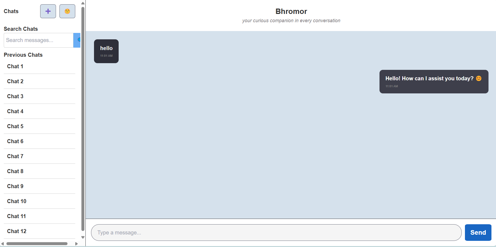

# 🐝 Bhromor – Smart Information Chatbot

**Bhromor** is a modern chatbot web app that provides smart, contextual answers using advanced AI language models through [OpenRouter.ai](https://openrouter.ai). It's built with **React**, **Node.js**, and integrates large language models (LLMs) like GPT-3.5, Claude, or Mixtral to deliver fast and intelligent responses.

> Whether you're curious about travel destinations, general knowledge, or need help with tasks — Bhromor is here to help!

---

## ✨ Features

- 🤖 **Chat Interface** – Clean, user-friendly chat UI with smooth interactions
- 🔍 **Web Search Integration** – Combines AI with Google Custom Search (optional)
- 🧠 **Powered by OpenRouter** – Choose from multiple LLMs like GPT-3.5, Claude, or Mixtral
- 💬 **Multi-turn Conversations** – Keeps chat context during the session
- 🗂️ **Chat History** – Navigate and review previous conversations
- 🌙 **Dark-Themed UI** – Inspired by modern chatbots like ChatGPT
- 🔐 **Secure Backend** – Express.js server for handling AI requests securely

---

## 📸 Preview



---

## ⚙️ Tech Stack

**Frontend**:
- React
- CSS (Custom styling)
- Responsive Layout

**Backend**:
- Node.js
- Express.js
- OpenRouter API
- Google Custom Search API (optional)

---

## 🚀 Getting Started

### 1. Clone the repo

```bash
git clone https://github.com/your-username/bhromor-chatbot.git
cd bhromor-chatbot
```

### 2. Install dependencies

**Frontend:**
```bash
cd client
npm install
```

**Backend:**
```bash
cd ../server
npm install
```

### 3. Setup API keys

Create a `.env` file in the `server` folder with:

```env
OPENROUTER_API_KEY=your_openrouter_key_here
```

### 4. Run the app

**Backend:**
```bash
npm run server
```

**Frontend:**
```bash
npm start
```

---

## 🧠 Customizing AI Model

You can easily swap models from the following (via OpenRouter):
- `deepseek/deepseek-r1-free`
- `openrouter/gpt-3.5-turbo`
- `mistralai/mixtral-8x7b`
- `anthropic/claude-3-haiku`
- `meta-llama/llama-3-8b-instruct`

Just update the model string in the backend code.

---


## 🙌 Credits

- [OpenRouter.ai](https://openrouter.ai)


